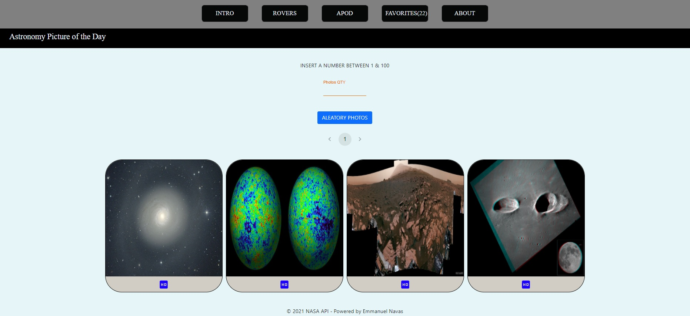

# NASA API APP - Mars Rover Expeditions -

- [ ] React
- [ ] Redux
- [ ] LocalStorage
- [ ] Firebase Auth
- [ ] Google Analytics
- [ ] Material UI
- [ ] Bootstrap
- [ ] HTML / CSS

Deploy: https://nasa-liart.vercel.app/

### Objective

- Challenge React
- Deploy: Vercel

## App Topic

The main reason of this App, its allow users to download photos from NASA API from Mars Rover

### LANDING:

  

### HOME:

  

### PHOTOS:

  

### APOD:

  

